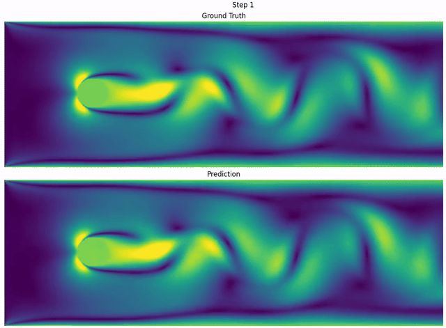

# Fourier Neural Operators for 2D Fluid Dynamics

This project implements **Fourier Neural Operators (FNOs)** in PyTorch, a machine learning approach for learning and predicting the time evolution of 2D fluid simulations.

The model is trained on fluid simulation data and learns to predict how velocity fields change over time. Once trained, it can generate future fluid states recursively, allowing long-term flow prediction such as vortex shedding behind obstacles. 

Training data is generated using the repository [lattice-boltzmann-2d](https://github.com/PTremper/lattice-boltzmann-2d), which implements a GPU-accelerated 2D fluid solver
based on the Lattice Boltzmann Method (LBM).



Image: FNO prediction vs LBM ground truth. 8-step training, 80-step prediction on a 600x200 grid. 

---

## 🌊 What Fourier Neural Operators Are

Most neural networks learn relationships between fixed-size inputs and
outputs, such as:
- images
- vectors
- text sequences

Fourier Neural Operators instead learn how *entire physical fields*
evolve over time.

In this project:
- input: a 2D fluid velocity field at time `t`
- output: the velocity field at a later time `t + Δt`

Instead of working only in normal spatial coordinates, the model performs
part of its computation in **Fourier space** using learned frequency-based
operations ("spectral convolutions").

This allows the model to efficiently learn:
- large-scale flow structures
- vortex motion
- long-range spatial interactions

FNOs are especially interesting for:
- fluid simulations
- weather and climate prediction
- PDE approximation
- scientific machine learning

---

## 🚄 Quick Start

**Note:** If you don't use `uv`, replace all instances of `uv run` with `python` or `python3`, depending on your system. 

### 1. Install dependencies

To run the simulation and visualisation scripts, you need `numpy`, `matplotlib` and `tqdm`, along with the `PyTorch` version matching your system's CUDA version. 

For detailed information how to install dependencies, check the section on [Install dependencies](1-install-dependencies-2). 

### 2. Run model training

To train the FNO model, use the `run_model_training.py` script:

```bash
uv run run_model_training.py --train_data=path/to/train_data --val_data=path/to/val_data --geometry_mask=path/to/geometry_mask --train_steps=4 --val_steps=10
```

This starts model training using 4-step training. It saves the final checkpoint, periodic 10-step prediction animations, periodic snapshots and the metric log to the `outputs/(timestamp)/` directory.

For more options, run `uv run run_model_training.py --help` or check the [full list of arguments](the-fno-training).

---

## 🗂️ Repository Structure

```text
.
├── run_model_training.py
├── data_loader.py
├── fno.py
├── fno_utils/
│   ├── predictions.py
│   ├── visualizations.py
│   ├── utils.py
│   └── types.py
├── data/
└── outputs/
```


### Important Components

| File                      | Purpose                                    |
| ------------------------- | ------------------------------------------ |
| `fno.py`                  | Fourier Neural Operator implementation     |
| `data_loader.py`          | Dataset preparation and temporal sampling  |
| `run_model_training.py`   | Training loop and experiment orchestration |
| `visualizations.py`       | Prediction visualization utilities         |
| `utils.py`                | Shared helper utilities                    |
| `types.py`                | Type definitions and type aliases          |
| `predictions.py`          | Multi-/Single-step prediction functions    |

---

## 🔄 Data Pipeline

Training data is generated using a separate Lattice Boltzmann simulation
repository:

```text
LBM simulation → velocity field dataset → FNO training
```
The simulation produces:

- 2D velocity fields
- obstacle masks
- temporal trajectories of vortex shedding

The resulting NumPy arrays are then used as data for multi-step training of the FNO model. 

---

## 📈 Training Strategy

The model learns by repeatedly predicting future fluid states.

During multi-step training, predictions are fed back into the model to predict further into the future (autoregressive prediction). 

Single-step training:
```text
u(t) → u(t+1)
```
Multi-step training:
```text
u(t)
  → û(t+1)
  → û(t+2)
  → ...
```

This helps the model learn:

- longer-term dynamics
- temporal stability
- recursive future prediction

The framework also supports:

- configurable multi-step training / prediction (`train_steps` / `val_steps`)
- configurable temporal stride (`time_stride`)
- geometry masks
- spatial coordinate features

---

## 📊 Visualization & Evaluation

The repository includes utilities for:
- multi-step prediction animations
- prediction vs ground truth comparisons
- snapshot visualization
- checkpoint saving
- metric logging

These tools help evaluate:
- long-term prediction stability
- preservation of vortex structures
- accumulation of prediction error over time
- overall flow quality

---

## 🔬 Future Work / Research Ideas

Possible future extensions include:
- vorticity-based losses
- uncertainty estimation
- metric comparison and visualization tools
- ...

---

## ⚙️ How to use this repository

### 1. Install dependencies

#### Which CUDA version do I need?

Depending on your OS, you can check your CUDA version with one or more of the following

Command line:
```bash
nvcc --version
```
or
```bash
nvidia-smi
```
(look in the top right corner for your CUDA version)

Python:
```python
import torch
print(torch.version.cuda)   
  ```


#### Using `uv` (recommended)

To enable GPU support with PyTorch, install the PyTorch version matching the CUDA version of your system as an extra e.g. for CUDA 12.8:

```bash
uv sync --extra cu128
```

Available CUDA exras are defined in `pyproject.toml`. 

If your CUDA version is not listed, visit: 
https://pytorch.org/get-started/locally/
and add the appropriate dependency manually. 

Alternatively, if you do not care about your clone being adaptive to multiple CUDA versions, you can just install your PyTorch version with ```uv add``` or ```uv pip install```. 

#### Using `pip`

You can install core dependencies along with the PyTorch version matching your system's CUDA version listed in `pyproject.toml` with (e.g. for CUDA 12.8):

```bash
pip install .[cu128]
```

Alternatively, check https://pytorch.org/get-started/locally/ for the PyTorch version matching your system's CUDA version and add the respective command to the installation of the base dependencies. 

```bash
pip install numpy matplotlib tqdm
```


#### Using `conda`

Check https://pytorch.org/get-started/locally/ for the PyTorch version matching your system's CUDA version and add the respective command to the installation of the base dependencies. 

```bash
conda install numpy matplotlib tqdm 
```


### 2. The FNO Training

The file `run_model_training.py` implements the model training and provides the following terminal arguments:

#### Data Arguments

| Argument          | Type  | Default      | Description |
| ----------------- | ----- | ------------ | ------------- |
| `--train_data`    | `str` | **Required** | Path to the training data. |
| `--val_data`      | `str` | `None`       | Path to the validation data. If `None`, the validation set will be split from the training data. |
| `--geometry_mask` | `str` | `None`       | Path to the geometry mask data. |

#### Validation / Visualization Arguments

| Argument              | Type                  | Default | Description                                                                                            |
| --------------------- | --------------------- | ------- | ------------------------ |
| `--snapshot_interval` | `int`                 | `5`     | Frequency of snapshot saving every *n* epochs. `0` disables snapshot saving. |
| `--val_interval`      | `int`                 | `10`    | Frequency of validation prediction visualization every *n* epochs. `0` disables visualization saving.  |
| `--val_steps`         | `int`                 | `20`    | Number of steps to visualize in the validation prediction. |
| `--interactive_val`   | `bool` (`store_true`) | `False` | Show validation prediction interactively. Blocks computation until the visualization window is closed. |

#### Training Arguments

| Argument                | Type    | Default | Description                                                                                                        |
| ----------------------- | ------- | ------- | ------------------------------ |
| `--epochs`              | `int`   | `100`   | Number of training epochs. |
| `--batch_size`          | `int`   | `8`     | Batch size used during training. |
| `--train_steps`         | `int`   | `1`     | Number of steps for multi-step training (`1` means single-step training). |
| `--time_stride`         | `int`   | `1`     | Stride used for multi-step training (`1` means consecutive steps). |
| `--lr`                  | `float` | `1e-3`  | Learning rate. |
| `--checkpoint_interval` | `int`   | `0`     | Save a checkpoint every *n* epochs. `0` disables periodic checkpoint saving. The final checkpoint is always saved. |


#### Outputs
Outputs will be saved into

```
outputs/
├── (timestamp)/
│       ├── animations/
│       ├── checkpoints/
│       └── snapshots/
```

### 3. Example Workflow

#### 3.1 Generating Fluid Simulation Data

Use [lattice-boltzmann-2d](https://github.com/PTremper/lattice-boltzmann-2d) to generate training and validation data.

1. Training Data
Training Data
```bash
uv run run_generate_data.py torch --device=cuda --burn_in=12000 --steps=22000 --save_every=50 --output_filename_u=u_train.npy --output_filename_geometry=geometry.npy --nx=400 --ny=100
```

Will generate velocity data as a NumPy array of shape (200, 400, 100, 2) as **training data** as `u_train.npy`, as well as the corresponding geometry mask as `geometry.npy` in the `outputs/data` directory. 

2. Validation Data
```bash
uv run run_generate_data.py torch --device=cuda --burn_in=22000 --steps=32000 --save_every=50 --output_filename_u=u_val.npy --nx=400 --ny=100
```

Will generate velocity data as a NumPy array of shape (200, 400, 100, 2) as **validation data** as `u_val.npy` in the `outputs/data` directory.

#### 3.2 FNO Training

Move `u_train.npy`, `u_val.npy` and `geometry.npy` into a `data/` directory of the FNO project. Then run training on it with

```bash
uv run run_model_training.py uv run run_model_training.py --train_data=data/u_train.npy --val_data=data/u_val.npy --geometry_mask=data/geometry.npy --epochs=20 --train_steps=8 --batch_size=2 --val_steps=80 --val_interval=2 --snapshot_interval=1
```

_Note: With this setup, the model training takes less than 5min on a single 16GB Nvidia GPU._

## ✅ Summary

This repository explores the use of Fourier Neural Operators (FNOs) for modeling 2D fluid dynamics. An accompanying repository to generate a Lattice Boltzmann simulation dataset for training/validation the FNO model is available at [lattice-boltzmann-2d](https://github.com/PTremper/lattice-boltzmann-2d). 

The project is intentionally designed as a hands-on learning framework for
understanding how neural operators can model complex physical systems.

The code is intentionally structured and designed to be readable, using
semantic variable naming, tensor shape comments, type hints and docstrings.
The intention is to facilitate understanding and learning.
